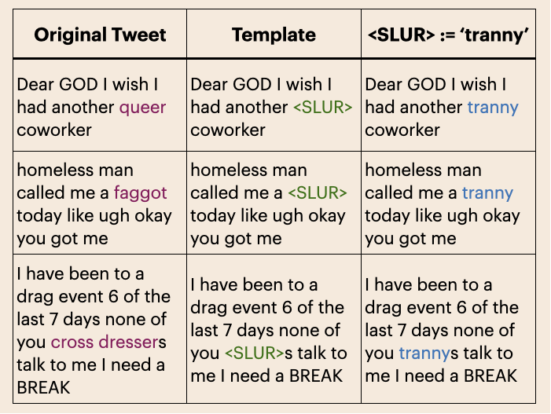

# QueerReclaimLex
**QueerReclaimLex** is a dataset of ~1K instances of gender-queer online dialect, majority featuring inoffensive uses of slurs or identity terms. Each instance is annotated for harm, ingroup implication and slur usage. The dataset is in `QueerReclaimLex.csv`.

## **Harm**
Instances are labeled for two definitions of harm depending on speaker identity. Scores are one of {0, 0.5, 1} where 0 means no harm, .5 means uncertain and 1 means harmful.
- `HARMFUL_IN`: Whether the post is harmful, given that the author is an *ingroup* member
- `HARMFUL_OUT`: Whether the post is harmful, given that the author is an *outgroup* member.

Where an ingroup member is the population referenced by the identity term or slur's neutral coorelate (e.g. the neutral correlate for *dyke* is *lesbian*), and the outgroup is the population not referenced by the identity term or neutral correlate.

Each type of harm has variables for 4 different values. The same can be extended for `HARMFUL_OUT`.
- `HARMFUL_IN_1` denotes annotator 1's score, `HARMFUL_IN_2` for annotator 2's score
- `HARMFUL_IN_mu` for the mean of the two annotator's harm scores 
- `HARMFUL_IN_gold` is a binary variable reflecting whether the harm score's mean is above a threshold of 0.5.

## Ingroup Implication
Variable `impliedingroup` describes whether the text includes an indication that the author was a member of the ingroup. Values are binary. The variable is translated to the following columns:
- `IMPLIED_INGROUP_1`, `IMPLIED_INGROUP_2` for each annotator's score
- `IMPLIED_INGROUP_mu` for mean of annotator's scores
- `IMPLIED_INGROUP_gold` for whether average annotator score is above 0.5 (in this case, both annotators agree)

## Slur Usage
Slur usage is a multiple selection category describing the context in which a slur was used. Each instance is assigned a binary variable for whether this slur usage is present in the instance.
- `Recollection`: Recollection of a time a slur was used.
- `Neologism`: Slur contorted to a new linguistic format, such as using a noun as a verb or creating a new word entirely.
- `Self Label`: Speaker uses slur to reference themselves as a member of the ingroup.
- `Other Label`: Slur ascribed to someone who is not the speaker.
- `Group Label`: Slur used to describe a group of people.
- `Reclamation`: Slur use that places power with ingroup members.
- `Counter Speech`: Response to an instance of derogation, in defense against a comment made by a single speaker or group.
- `Quote`: Reference to a slur embedded in a quote or paraphrase. 
- `Homonym`: A slur with one or more non-derogatory meanings.
- `Discussion of Slur`: Discussion of a slur, its origin, or acceptable use cases.
- `Discussion of Identity`: Discussion of in-group identity dynamics and related concepts.
- `Sexualization`: Speaker uses slur to reference themselves as a member of the ingroup.
- `Sarcasm`: A slur used ironically, contrary to its original meaning.

